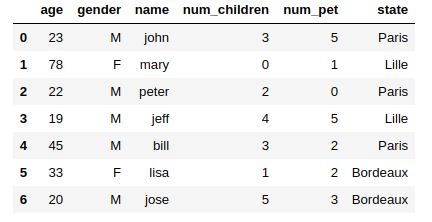

# DataFrame

## Définition

Un Dataframe est semblable à un dictionnaire dont les clés sont les noms des colonnes (columns) et les valeurs des séries. Vous pouvez également définir des index spécifiques.

```python
temperatures = np.array([
    [25, 28.5, 30],
    [33, 29, 35],
    [38, 39, 44],
])

# Def des index et colonnes
temperatures_df = pd.DataFrame(
    temperatures,
    index = ['Bordeaux', 'Paris', 'Lille'],
    columns = ['2001', '2002', '2003']
)
```

L'objet **temperatures_df** est un tableau (DataFrame) à deux dimensions :

```txt
	        2001	2002	2003
Bordeaux    25.0	28.5	30.0
Paris	    33.0	29.0	35.0
Lille	    38.0	39.0	44.0
```

Voici quelques fonctions élémentaires pour commencer sur les DataFrames :

- df.info() : information sur le DataFrame.
- df.head(2) : Deux premières lignes du DataFrame.
- df.head(), df.tail() : les 5 premières ou les 5 dernières (par défaut df.head(n = 5) et df.tail(n=5))
- df.columns : noms des colonnes : Index(['2001', '2002', '2003'], dtype='object').
- df.columns.values : Noms des colonnes dans un array Numpy.
- df.index : Noms des lignes : Index(['Bordeaux', 'Paris', 'Lille'], dtype='object').
- df.index.values : Noms des lignes dans un array Numpy.
- df.values : DataFrame dans un array 2d Numpy.
- df.describe() : statistiques sur les colonnes numériques (moyenne, écart-type, ...)
- df.shape : donne les dimensions du DataFrame.

## Construire un DataFrame avec un dictionnaire

Voici comment vous pouvez construire un **DataFrame** facilement à partir d'un dictionnaire en Python, les clés sont les noms des colonnes :

```python
import pandas as pd

dataset = {
    'name':['john','mary','peter','jeff','bill','lisa','jose'],
    'age':[23,78,22,19,45,33,20],
    'gender':['M','F','M','M','M','F','M'],
    'city':[
        'Paris','Lille',
        'Paris','Lille','Paris',
        'Bordeaux','Bordeaux'
    ],
    'num_children':[3,0,2,4,3,1,5],
    'num_pet':[5,1,0,5,2,2,3]
}

df = pd.DataFrame(dataset)
df.head(7)
```

Ici on ne précise pas d'index pour le DataFrame, Pandas utilisera par défaut un index numérique :



## Sélectionner des valeurs dans le DataFrame

### Méthode [] : df[]

```python
# Chaque clé est le nom d'une colonne
# Chaque liste Python contient les valeurs de la colonne
data = {
    'city': ['Lille', 'Paris', 'Lyon', 'Marseille', 'Aubenas'],
    'year': [2000, 2001, 2002, 2001, 2020],
    'pop': [0.232, 2.141, 0.513, 0.861, 0.012]
}

df = pd.DataFrame(data, index=['59', '75', '69', '13', '07'])

print(df)

"""
        city  year    pop
59      Lille  2000  0.232
75      Paris  2001  2.141
69       Lyon  2002  0.513
13  Marseille  2001  0.861
07    Aubenas  2020  0.012

"""
```

Pour accéder à la première colonne "city" on pourra utiliser la syntaxe suivante :

```python
df['city']

"""
59        Lille
75        Paris
69         Lyon
13    Marseille
07      Aubenas
"""
```

Si on souhaite accéder à plusieurs colonnes, par exemple ici à deux colonnes en même temps, on écrira :

```python
df[ ['city', 'year'] ]
"""
    city	year
59	Lille	2000
75	Paris	2001
69	Lyon	2002
13	Marseille	2001
07	Aubenas	2020
"""
```

Vous pouvez utiliser la notion de mask avec un DataFrame, ici on sélectionnera les villes ayant plus de 500 000 habitants :

```python
df[ df['pop'] > 0.5 ]
"""
        city  year    pop
75      Paris  2001  2.141
69       Lyon  2002  0.513
13  Marseille  2001  0.861
"""
```

Attention le slicing numérique sert uniquement à sélectionner des lignes :

```python
df[0:2]
"""
     city  year    pop
59  Lille  2000  0.232
75  Paris  2001  2.141
"""
```

### Méthode loc : df.loc[row] et df.loc[row, column]

La méthode .loc utilise les étiquettes de ligne et de colonne : loc[ row, column]

```python
df.loc['59']
"""
city    Lille
year     2000
pop     0.232
"""
```

Vous pouvez à l'aide de cette dernière syntaxe faire du slicing sur les index :

```python
df.loc['75':'07']

"""
        city  year    pop
75      Paris  2001  2.141
69       Lyon  2002  0.513
13  Marseille  2001  0.861
07    Aubenas  2020  0.012
"""
```

On peut également sélectionner ligne(s) et colonne(s) :

```python

df.loc['75':'07', 'pop']

"""
75    2.141
69    0.513
13    0.861
07    0.012
"""
```

Un autre exemple de sélection :

```python
df.loc['75':'07', 'city': ]
```

### Méthode iloc : iloc[row, column] row et column indexés seulement numériquement

```python
# row, column
df.iloc[1:, 1:]
"""
    year    pop
75  2001  2.141
69  2002  0.513
13  2001  0.861
07  2020  0.012
"""
```

## Exercice création de DataFrame

Créez les DataFrames suivants :

1. DataFrame **fruits1**

```txt
---------------------------------
|   |   Rapsberry | Cherries    |
---------------------------------
| 0 |   30        |  20         |
---------------------------------
```

2. DataFrame **fruits2**

```txt
------------------------------------
|       |   fig       |     wine    |
------------------------------------
| 2020  |   130       |  120        |
------------------------------------
| 2019  |   309       |  290        |
------------------------------------
```
