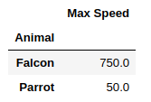
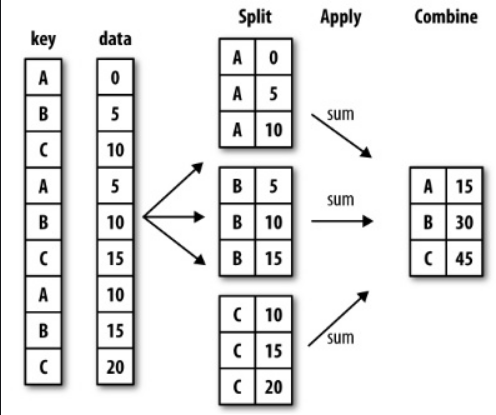

# Agrégation

## Group By

La méthode **groupby** sur un objet Pandas permet de regrouper des données en fonction d'une colonne ou de plusieurs colonnes. Elle permet alors d'appliquer une fonction d'aggrégation sur ce groupe, comme par exemple la moyenne ou une somme.

Le **groupby** est similaire dans sa définition au groupby SQL que nous verrons par la suite.

```python

df = pd.DataFrame({
    'Animal': [
    'Falcon', 'Falcon',
    'Parrot', 'Parrot'
    ],
    'Max Speed': [380., 370., 24., 26.]
})

df.groupby(['Animal'])

```

Une fois que vous avez groupé les valeurs par nom de colonne ou de lignes, vous pouvez appliquer une fonction d'agrégation :

```python
df.groupby(['Animal'])
.aggregate(lambda x : sum(x))
```



Voic le schéma général du groupby dans Pandas :



\newpage

## Exercice de regroupement par pays

1. Reprenez le dataset suivant et donnez le nombre d'enfant(s) par ville dans un tableau à deux colonnes **city** & **num_children**.

2. Quel est l'écart des ages des habitants par ville ?

3. Est-ce que les femmes mariées ont plus d'enfant que les hommes divorcés ?

4. Quelle est la ville ou les femmes ont le plus de chien ? Même question pour les hommes ?

```python
dataset = {
    'name':['john','mary','peter','jeff','bill','lisa','jose'],
    'age':[23,78,22,19,45,33,20],
    'gender':['M','F','M','M','M','F','M'],
    'city':['Paris','Lille','Paris','Lille',
    'Paris','Bordeaux','Bordeaux'],
    'num_children':[3,0,2,4,3,1,5],
    'num_pet':[5,1,0,5,2,2,3],
    'status' : ['married', 'married', 'married', 'divorced', 'divorced', 'married', 'married']
}
```

## Exercice pourboires

Vous allez travailler avec un jeu de données : **tips**, pourboires dans un restaurant.

Récupérez la source à l'adresse suivante : [tips](https://github.com/pandas-dev/pandas/blob/master/doc/data/tips.csv)

Vous enregistrerez ce fichier à la racine de vos notebooks, puis importez le dans votre notebook de la manière suivante :

```python
tips = pd.read_csv('data/tips.csv')
```

1. Ajoutez une colonne **tips_perct** au DataFrame tips, elle calculera le pourcentage de chaque pourboire par rapport au total des pourboires.

2. Quelles sont les pourcentages des pourboires par rapport au sex et à la consommation de tabac ? Donnez leurs moyennes et écarts types.

3. Calculez l'étendue des pourboires pour les femmes qu'elles fument ou ne fument pas. Créez une fonction peak_to_peak et appliquez cette fonction, comme une fonction d'agrégation, à votre groupement à l'aide de la fonction agg de Pandas.

4. En utilisant le même regroupement par sex et smoker et en utilisant la fonction agg de Pandas, calculez le max des pourboires ainsi que le nombre. Vous pouvez passer à la méthode agg un dictionnaire pour spécifier les fonctions à appliquer par colonne.

## Exercice grouper avec un dictionnaire

On supposera qu'il existe une relation entre les colonnes a et b puis c, d et e. On nommera ces deux relations respectivement "first" et "second".

1. Créez le DataFrame population avec les données ci-après.

2. Créez un dictionnaire mapping, les clés sont les noms des colonnes et les valeurs les noms des relations. Puis appliquez ce mapping à votre regroupement sur les colonnes. Faites la somme de ces valeurs.

```python
data = [
    [ 1.00337786,  1.60212136,  0.4597855 ,  0.50281771,  0.65316509],
    [-0.57524468, -0.19829894,  0.05230613, -0.03159951, -0.42909259],
    [ 0.54683457,  1.85576317, -0.62295055, -1.43870874, -0.4367706 ],
    [ 1.18701531,  0.59918783,  0.78498521,  1.25839299, -0.97814535],
    [ 0.51031798, -2.35260978, -1.87559638, -0.23625731,  2.14360896]
]

 index =  ["Alan", "Bernard", "Sophie", "Noe", "Alice"]
 columns = list("abcde")
```
