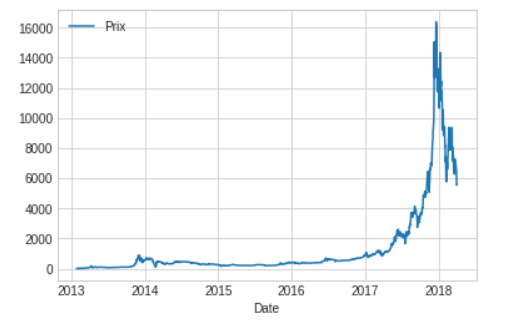

# Exploration dataset

## Exercice &Eacute;cart de salaires

Vous allez maintenant étudier l'écart des salaires des habitants de la ville de Boston par département sur l'année 2018. Récupérez le fichier csv à l'adresse suivante :
[Analyse Boston](https://data.boston.gov/dataset/employee-earnings-report/resource/31358fd1-849a-48e0-8285-e813f6efbdf1)

Puis une fois dans votre notebook tapez la ligne de code suivante pour importer les données dans un DataFrame :

```python
# DataFrame
boston = pd.read_csv('../data/boston.csv')
```

### Préparation des données

1. Formatez les données de la colonne TOTAL EARNINGS pour les rendre compatibles avec un type numérique. Vous utilisez la méthode astype, voyez exemple ci-dessous :

```python
df[colunm].astype(float)
```

2. Ordonnez les écarts par ordre décroissant.

## Exercice Bitcoin

Récupérez les sources sur le serveur.

Affichez les données :

```python
bitcoins =pd.read_csv('data/Cours_BTC2FEUR_-_Feuille_1.csv')
bitcoins.head()
```

1. Nettoyer la colonne Prix pour avoir cette colonne dans le type flaot.

2. Représentez graphiquement le cours du Bitcoin.



## Exercice Nuage de points

Soit le dataset suivant :

```python

dataset = {
    'name':['john','mary','peter','jeff','bill','lisa','jose'],
    'married' : ['yes', 'yes', 'no', 'yes', 'no', 'no', 'yes', 'no'],
    'age':[23,78,22,19,45,33,20],
    'genre':['M','F','M','M','M','F','M'],
    'state':['Paris','Lille','Paris','Lille','Paris','Bordeaux','Bordeaux'],
    'num_children':[3,0,2,4,3,1,5],
    'num_pet':[5,1,0,5,2,2,3]
}

```

1. Affichez par état le nombre d'enfant(s).

2. Affichez par état le nombre d'enfant(s) des couples mariés.

3. Est-ce que les personnes mariées ont plus d'enfant(s) ?

4. Est-ce que les personnes divorcées ont plus de chien que les couples mariés ?

5. Calculez la moyenne du nombre d'enfant(s) chez les couples divorcés.

## Exercice réserves parlementaires

Récupérez sur le serveur le dataset suivant :

reserve-parlementaire-2011-openspending.csv

Une réserve parlementaire est un ensemble de subventions du budgets de l''État. Cette réserve permet aux parlementaires de l'Assemblée Nationale et également au Sénat de financer des associations et des collectivités de leur circonscription.

Voir Wikipédia pour plus d'information sur ce thème : [réserve parlementaire](https://fr.wikipedia.org/wiki/R%C3%A9serve_parlementaire).

Explorez ce dataset en proposant un ensemble de questions de votre choix.
