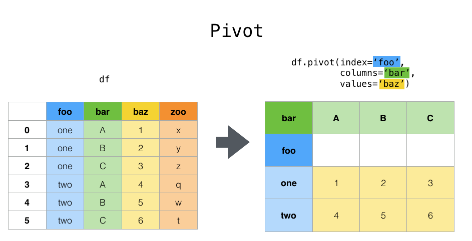

# Prénoms des enfants aux Etats-Unis

## Présentation & organisation

L'administration américaine de la sécurité sociale (USSSA ou SSA) a rendu publique les données sur la fréquence des prénoms attribués aux bébés depuis 1880 jusqu'en 2018.

Récupérez les sources names.zip à l'adresse suivante : [baby](https://www.ssa.gov/oact/babynames/limits.html), puis dézippez celle-ci dans un dossier data à la racine de vos notebook.

1. Récupérez le fichier yob1880.txt et créez un DataFrame names1880 à partir de ces données. Pour charger ce DataFrame vous utiliserez la méthode **read_csv** de Pandas. Renommez les colonnes avec l'argument **names** de cette méthode avec respectivement les noms suivants  : "name", "sex" et "birth".

2. Donnez le nombre de naissances par sex pour l'année 1880.

3. Créez un script permettant de récupérer les prénons de 1880 à 2018 à partir des fichiers du dossier names et utiliser la méthode concat pour les rassembler.

4. Agrégez les données pour avoir deux colonnes F et M. Et faites la sommes des naissances par sex et year. Vous pouvez utiliser la méthode pivot_table.

5. Représentez graphiquement le nombre de naissances par année.

6 Ajoutez une colonne **prop** pour renseigner la proportion du nombre de naissances par rapport au total des naissances par sex et année. Dans ce but créez une fonction **get_counts** qui calculera cette proportion pour chacun de ces groupes.
Vérifiez maintenant que pour tous les groupes la somme des proportions est bien égale à 1. Utilisez la méthode **np.allclose** de Numpy.

8. Extrayez maintenant des sous-ensembles de 1000 prénoms par groupe. Créez une fonction get_top1000 qui les calculera.

Dans la suite on travaillera avec ces sous-ensembles.

9. Créez maintenant une table pivot du nombre de naissances par an et par prénoms.

10. Etudiez maintenant la tendance des prénoms suivants : "John" et "Harry" (faites un graphique).

11. Essayez maintenant de mesurer la diversité des prénoms.
